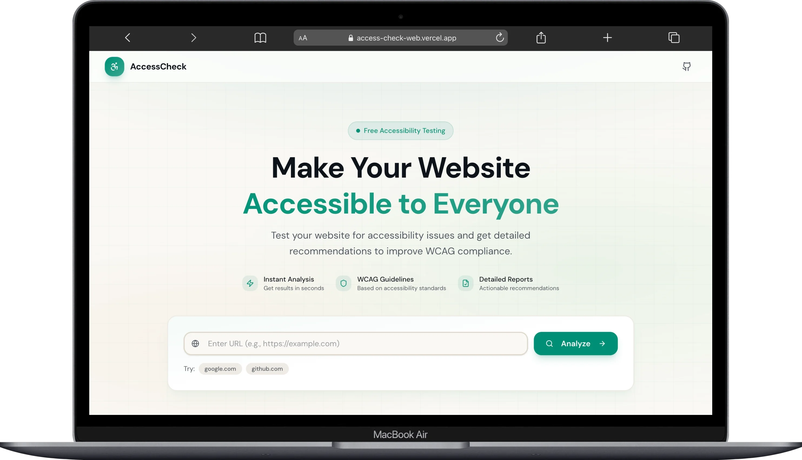
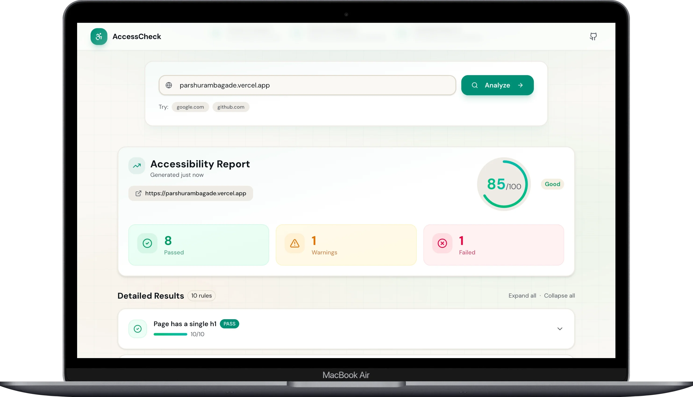
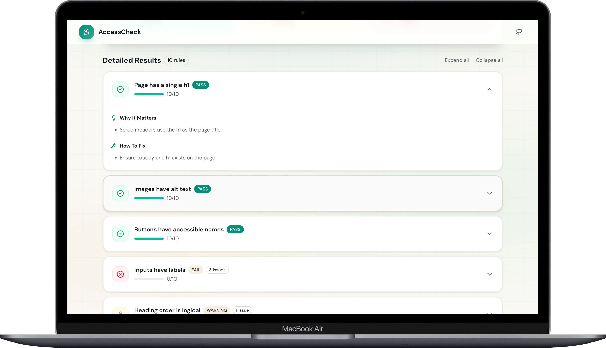
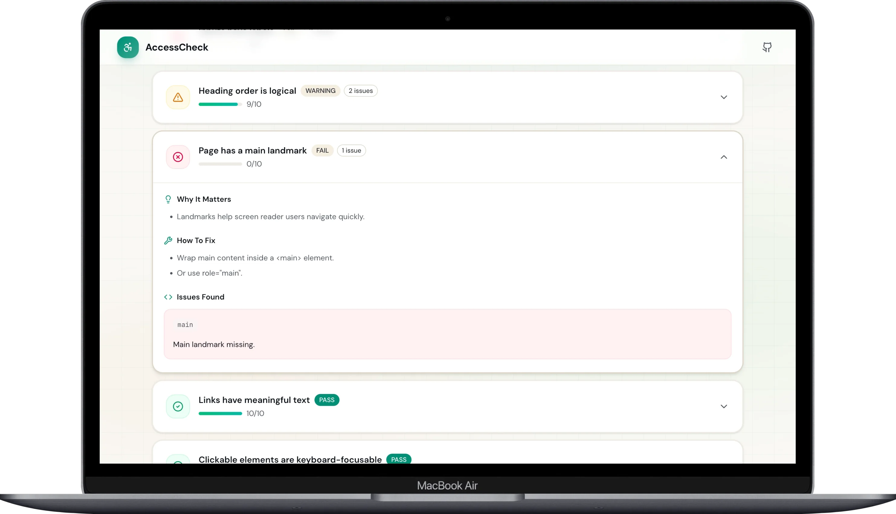

## AccessCheck

**AccessCheck** is a lightweight web accessibility audit tool that checks a URL against **10 common accessibility rules** and generates a clean, actionable report (scores, issues, and how-to-fix guidance).

- **Live demo**: [access-check-web.vercel.app](https://access-check-web.vercel.app/)
- **GitHub**: [github.com/parshurambagade/access-check](https://github.com/parshurambagade/access-check)

### Screenshots

<table>
  <tr>
    <td></td>
    <td></td>
  </tr>
  <tr>
    <td></td>
    <td></td>
  </tr>
</table>

### What it does

- **Input**: A website URL
- **Process**: Fetch HTML (server-side) → parse with Cheerio → run rules → generate a report
- **Output**: Overall score, rule-by-rule results, and recommended fixes

### Accessibility rules covered (10)

This project does **not** aim to replace enterprise-grade scanners. Instead, it focuses on **10 high-signal checks** that catch common issues quickly:

1. **Document language is defined** (e.g., `<html lang=\"en\">`)
2. **Images have alt text**
3. **Buttons have accessible names**
4. **Inputs have labels**
5. **Page has a single `<h1>`**
6. **Heading order is logical**
7. **Page has a main landmark** (`<main>` / `role=\"main\"`)
8. **Links have meaningful text**
9. **Clickable elements are keyboard-focusable**
10. **ARIA roles are not misused** (invalid roles, redundant roles on native elements)

### Tech stack

- **Frontend**: Next.js (App Router), React, TypeScript
- **UI**: Tailwind CSS v4, Shadcn UI
- **Backend**: Next.js Route Handlers
- **Validation**: Zod
- **HTML parsing**: Cheerio

### Local setup

```bash
pnpm install
pnpm dev
```

Open `http://localhost:3000`.

### API

#### `POST /api/audit`

**Request body**:

```json
{ "url": "https://example.com" }
```

**Example**:

```bash
curl -X POST http://localhost:3000/api/audit \
  -H "Content-Type: application/json" \
  -d '{"url":"https://example.com"}'
```

**Response (shape)**:

- `url`: audited URL
- `overallScore`: 0–100
- `summary`: pass/warning/fail counts
- `rules[]`: per-rule status, score, issues, and guidance

### Project structure (high level)

- **API route**: `app/api/audit/route.ts`
- **Audit engine**: `lib/audit/runAudit.ts` + `lib/audit/rules/*`
- **Rule metadata**: `constants/audit.ts`
- **UI**: `components/*` (search + report)

### Notes / limitations

- **Some sites block server fetches (403/anti-bot/CDN protections)**. When that happens, the API returns a fetch error. Try another URL or a site that allows server-side fetching.
- These checks are intentionally scoped: they cover common patterns, not every WCAG edge case.

### Roadmap (nice next steps)

- Add more rules (color contrast, form error messaging, skip links, ARIA attributes validity)
- Better reporting (export JSON/PDF, shareable report link)
- Smarter fetch (timeouts, retries, follow redirects, better error messages)

### Author

**Parshuram Bagade**

- GitHub: [github.com/parshurambagade](https://github.com/parshurambagade)
- Portfolio: [parshurambagade.vercel.app](https://parshurambagade.vercel.app)